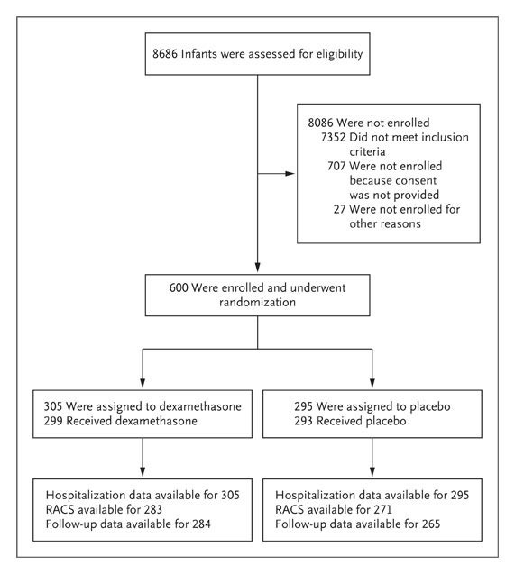
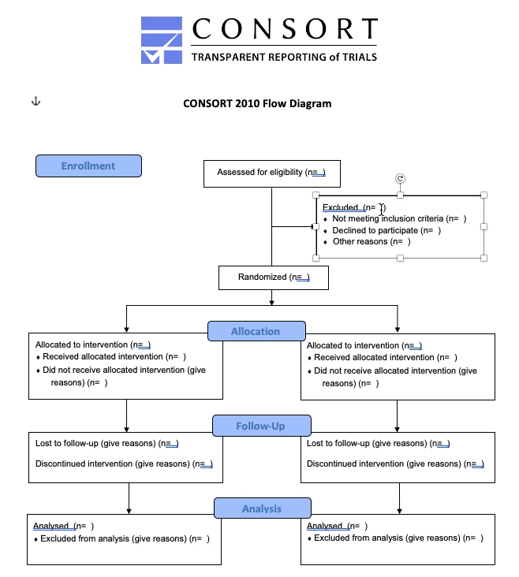
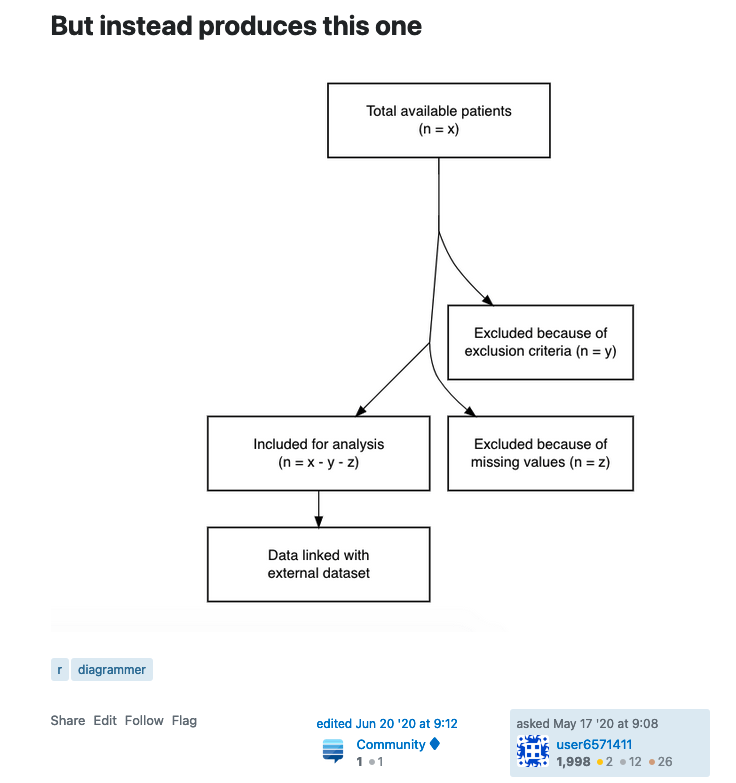
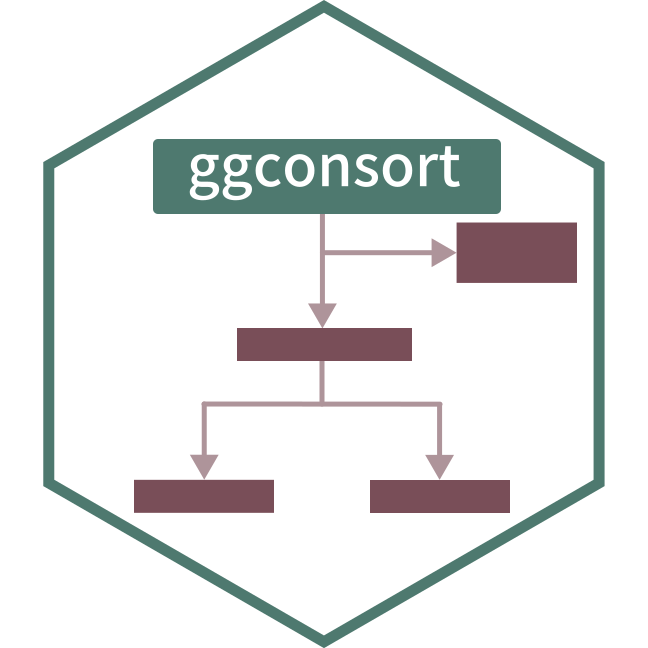

```{r xaringan-themer, include=FALSE, warning=FALSE}
library(xaringanthemer)

style_duo_accent(
  primary_color = "#4e796f",
  secondary_color = "#794e58",
  colors = list(
    offwhite = "#f5f0e4",
    green = "#4e796f",
    burgundy = "#794e58",
    purple = "#5A4E79",
    lightgreen = "#6E794E"
  ),
  extra_fonts = list(google_font("Raleway"))
)

xaringanExtra::use_extra_styles(
  mute_unhighlighted_code = TRUE  #<<
)
```

```{r setup, include=FALSE, warning=FALSE}
library(dplyr)
library(ggplot2)
library(ggconsort)

# higlight code from
# https://www.garrickadenbuie.com/blog/highlight-lines-without-breaking-the-code-in-xaringan/
hook_source <- knitr::knit_hooks$get('source')
knitr::knit_hooks$set(source = function(x, options) {
  x <- stringr::str_replace(x, "^[[:blank:]]?([^*].+?)[[:blank:]]*#<<[[:blank:]]*$", "*\\1")
  hook_source(x, options)
})
```

class: center middle

## 臨床研究のフローチャートが描ける`ggconsort`パッケージの紹介

### nissinbo

---

## [R/Medicine2021の発表](https://github.com/tgerke/ggconsort-talk) が元ネタです。

- 本スライドは冗長気味に書いたので、ぜひ元ネタの方もご覧ください。
- [sample_code.R](sample_code.R)に今回使用したサンプルコードを入れたので実際に動かしてみてください

---

### CONSORT diagram とは

- 臨床研究において患者選択や割り当ての流れを示したフローチャート
    - ランダム化比較試験 (RCT) の報告に焦点を当てているが、観察研究にも適用は可能（だと思う）

<br>

<!-- image source https://www.nejm.org/doi/full/10.1056/nejmoa071255 -->

.h-center.w-35[

]

---
### よくある CONSORT diagram の作り方

<br>

- [Word形式のテンプレート](http://www.consort-statement.org/consort-statement/flow-diagram)を、Officeで編集して作成することが多い

.h-center.w-50[

]

---

### Officeで作図 苦手なんだよなあ

- コピペ作業、体裁を整える作業で消耗したくない
- データと紐付けて、患者数を自動で入れたい
- できれば ggplot2 で書きたい

---
### 「R でフローチャート作成」 のこれまで

- .green[ggplot2] とは異なる方法での開発が進んでいた

  - .green[DiagrammeR/Graphviz]: [Wong 2018](https://dannyjnwong.github.io/STROBE-CONSORT-Diagrams-in-R/), [Higgins/Gerber 2020](https://github.com/higgi13425/ggconsort/pull/1), [Köhler 2017](https://scriptsandstatistics.wordpress.com/author/koehlern/)
  - .green[tikz]: [Gerke lab 2018](https://github.com/GerkeLab/consoRt)
  - .green[JS]: [Gerke 2021](https://github.com/tgerke/flowcharter)

.h-center.w-40[

]

---

### 期待の新星 `ggconsort`

.h-center.w-50[

]

- ggplot2 ベースで、臨床試験や観察研究のフローチャートを作成できる！
- [Travis Gerke](https://github.com/tgerke) 作

---

## 参考資料

- [R/Medicine2021 資料](https://github.com/tgerke/ggconsort-talk)
- [R/Medicine2021 Youtube](https://www.youtube.com/watch?v=a8A638n6Qew)
- [公式リファレンス](https://tgerke.github.io/ggconsort/index.html)
- [GitHubリポジトリ](https://github.com/tgerke/ggconsort)

公式リファレンスを見れば一通り理解することができます。

---

## パッケージのインストール

- 2021年10月現在、CRAN にはないようです
- 「ggconsort」でググると先に出てくる以下のレポジトリとは異なるため注意！
    - https://github.com/higgi13425/ggconsort

```{r eval=FALSE}
remotes::install_github("tgerke/ggconsort")
# https://github.com/tgerke/ggconsort
```

---

## `ggconsort` での作成手順

2つの手順でフローチャートを作成します

1. 患者数カウントとラベル付け
1. 図のレイアウトとデザイン

---
class: center middle

## 患者数カウントとラベル付け

---

### 使用するデータ

`ggconsort` のサンプルデータを表示する

- idに重複のない、患者1人につき1行のデータ

```{r cohorts-1}
trial_data
```

---
### コホートの開始

- `cohort_start()` で**フローチャートの始点**となるデータを指定
    - データフレームからパイプでつなげる

```{r cohorts-2}
trial_data %>%
  cohort_start("Assessed for eligibility") #<<
```

---
### 選択基準

- `cohort_define()` で患者条件を指定
    - 引数の中では `dplyr::filter` で患者を選択する
    - `.full` はコホート全体（`cohort_start`）を表す

```{r cohorts-3}
trial_data %>%
  cohort_start("Assessed for eligibility") %>% 
  cohort_define( #<<
    consented = .full %>% filter(declined != 1) #<<
  ) #<<
```

---
### 選択基準

- `cohort_decline()` 内はカンマでつなげることで条件を連続で指定できる
    - 以下では、たった今定義したサブコホート （`consented`） をもとに `consented_chemonaive` を定義している

```{r cohorts-4}
trial_data %>%
  cohort_start("Assessed for eligibility") %>% 
  cohort_define(
    consented = .full %>% filter(declined != 1),
    consented_chemonaive = consented %>% filter(prior_chemo != 1) #<<
  )
```

---
### 群分け

群分けもここで指定

```{r cohorts-5}
trial_data %>%
  cohort_start("Assessed for eligibility") %>% 
  cohort_define(
    consented = .full %>% filter(declined != 1),
    consented_chemonaive = consented %>% filter(prior_chemo != 1),
    randomized = consented_chemonaive %>% filter(bone_mets != 1), #<<
    treatment_a = randomized %>% filter(treatment == "Drug A"), #<<
    treatment_b = randomized %>% filter(treatment == "Drug B") #<<
  )
```

---
### 除外基準

- 除外された人数を示すためには `anti_join()` が便利

```{r cohorts-6}
trial_data %>%
  cohort_start("Assessed for eligibility") %>% 
  cohort_define(
    consented = .full %>% filter(declined != 1),
    consented_chemonaive = consented %>% filter(prior_chemo != 1),
    randomized = consented_chemonaive %>% filter(bone_mets != 1),
    treatment_a = randomized %>% filter(treatment == "Drug A"),
    treatment_b = randomized %>% filter(treatment == "Drug B"),
    # anti_join is useful for counting exclusions -------------
    excluded = anti_join(.full, randomized, by = "id") #<<
  )
```

---
### ラベル付け

`consort_label()` に実際のフローチャートで表示するラベルを入力

```{r cohorts-7, results='hide'}
trial_data %>%
  cohort_start("Assessed for eligibility") %>% 
  cohort_define(
    consented = .full %>% filter(declined != 1),
    consented_chemonaive = consented %>% filter(prior_chemo != 1),
    randomized = consented_chemonaive %>% filter(bone_mets != 1),
    treatment_a = randomized %>% filter(treatment == "Drug A"),
    treatment_b = randomized %>% filter(treatment == "Drug B"),
    # anti_join is useful for counting exclusions -------------
    excluded = anti_join(.full, randomized, by = "id")
  ) %>%
  cohort_label( #<<
    consented = "Consented", #<<
    consented_chemonaive = "Chemotherapy naive", #<<
    randomized = "Randomized", #<<
    treatment_a = "Allocated to arm A", #<<
    treatment_b = "Allocated to arm B", #<<
    excluded = "Excluded" #<<
  ) -> study_cohorts #<<
```

```{r cohorts-8, include=FALSE}
study_cohorts <- 
  trial_data %>%
  cohort_start("Assessed for eligibility") %>%
  # Define cohorts using named expressions --------------------
  # Notice that you can use previously defined cohorts in subsequent steps
  cohort_define(
    consented = .full %>% filter(declined != 1),
    consented_chemonaive = consented %>% filter(prior_chemo != 1),
    randomized = consented_chemonaive %>% filter(bone_mets != 1),
    treatment_a = randomized %>% filter(treatment == "Drug A"),
    treatment_b = randomized %>% filter(treatment == "Drug B"),
    # anti_join is useful for counting exclusions -------------
    excluded = anti_join(.full, randomized, by = "id"),
    excluded_declined = anti_join(.full, consented, by = "id"),
    excluded_chemo = anti_join(consented, consented_chemonaive, by = "id"),
    excluded_mets = anti_join(consented_chemonaive, randomized, by = "id")
  ) %>%
  # Provide text labels for cohorts ---------------------------
  cohort_label(
    consented = "Consented",
    consented_chemonaive = "Chemotherapy naive",
    randomized = "Randomized",
    treatment_a = "Allocated to arm A",
    treatment_b = "Allocated to arm B",
    excluded = "Excluded",
    excluded_declined = "Declined to participate",
    excluded_chemo = "Prior chemotherapy",
    excluded_mets = "Bone metastasis"
  )
```

---
### ラベル付け

作成した `study_cohorts` は`ggconsort_cohort` オブジェクトと呼ばれ、 `summary` 関数で定義したサブコホートの一覧を表示できる

```{r cohorts-summary}
summary(study_cohorts)
```

---
class: center middle

## レイアウトとデザイン

---

### `cohort_count_adorn()`

- 定義したサブコホートのラベルを表示する関数
- `.label_fn` 引数でラベルのフォーマットをカスタムできる

```{r adorn}
cohort_count_adorn(study_cohorts, randomized)
```

```{r custom-adorn}
cohort_count_adorn(
  study_cohorts, 
  .label_fn = function(cohort, label, count, ...) {
    glue::glue("{count} {label}")
  })
```

---
### `consort_box_add()`

- Box を追加する関数
- name にはフローチャート内で使う名前を指定
- x, y には座標を入力
- `label` では `cohort_count_adorn()` を使い、事前に設定したラベル付けを適用

```{r layout-1, fig.retina=3, fig.align='center', fig.height=3}
study_cohorts %>%
  consort_box_add( #<<
    name = "full", x = 0, y = 50, label = cohort_count_adorn(., .full) #<<
  ) #<<
```

---
### `consort_box_add()`

- パイプでつないで作成していく

```{r layout-2, fig.retina=3, fig.align='center', fig.height=3}
study_cohorts %>%
  consort_box_add(
    name = "full", x = 0, y = 50, label = cohort_count_adorn(., .full)
  ) %>%
  consort_box_add( #<<
    "randomized", 0, 30, cohort_count_adorn(., randomized) #<<
  ) #<<
```

---
### 複数条件を1つの Box に入れる

- Box 内に複数の条件を入れる際は label 引数を編集する
    - `glue::glue()` は文字列の結合に便利な関数
    - `cohort_count_adorn()` の中身の文字列を渡す

```{r layout-3, fig.retina=3, fig.align='center', fig.height=3, fig.show='hide', eval=FALSE}
study_cohorts %>%
  consort_box_add(
    name = "full", x = 0, y = 50, label = cohort_count_adorn(., .full)
  ) %>%
  consort_box_add(
    "randomized", 0, 30, cohort_count_adorn(., randomized)
  ) %>%
  consort_box_add( #<<
    "exclusions", 20, 40, label = glue::glue( #<<
      '{cohort_count_adorn(study_cohorts, excluded)}<br> #<<
      • {cohort_count_adorn(study_cohorts, excluded_declined)}<br> #<<
      • {cohort_count_adorn(study_cohorts, excluded_chemo)}<br> #<<
      • {cohort_count_adorn(study_cohorts, excluded_mets)} #<<
      ') #<<
  ) #<<
```

---
### フローチャートの表示

- 作成したオブジェクトを `ggplot()`に入れ、`geom_consort()` を使う
- `theme_consort()` で余白を調整

```{r layout-4-add, fig.retina=3, fig.align='center', fig.height=3, fig.show='hide', eval=FALSE}
study_cohorts %>%
  consort_box_add(...) %>% 
  ggplot() +  #<<
  geom_consort() +  #<<
  theme_consort(margin_h = 8, margin_v = 1) #<<
```

```{r layout-4, fig.retina=3, fig.align='center', fig.height=4, echo=FALSE}
study_cohorts %>%
  consort_box_add(
    name = "full", x = 0, y = 50, label = cohort_count_adorn(., .full)
  ) %>%
  consort_box_add(
    "randomized", 0, 30, cohort_count_adorn(., randomized)
  ) %>%
  consort_box_add(
    "exclusions", 20, 40, glue::glue(
      '{cohort_count_adorn(study_cohorts, excluded)}<br>
      • {cohort_count_adorn(study_cohorts, excluded_declined)}<br>
      • {cohort_count_adorn(study_cohorts, excluded_chemo)}<br>
      • {cohort_count_adorn(study_cohorts, excluded_mets)}
      ')
  ) %>% 
  ggplot() + 
  geom_consort() + 
  theme_consort(margin_h = 8, margin_v = 1)
```

---
### 群分けの Box を追加

```{r layout-5, fig.retina=3, fig.align='center', fig.height=5, eval=FALSE}
study_cohorts %>%
  consort_box_add(
    name = "full", x = 0, y = 50, label = cohort_count_adorn(., .full)
  ) %>%
  consort_box_add(
    "randomized", 0, 30, cohort_count_adorn(., randomized)
  ) %>%
  consort_box_add(
    "exclusions", 20, 40, glue::glue(
      '{cohort_count_adorn(study_cohorts, excluded)}<br>
      • {cohort_count_adorn(study_cohorts, excluded_declined)}<br>
      • {cohort_count_adorn(study_cohorts, excluded_chemo)}<br>
      • {cohort_count_adorn(study_cohorts, excluded_mets)}
      ')
  ) %>% 
  consort_box_add( #<<
    "arm_a", -30, 10, cohort_count_adorn(., treatment_a) #<<
  ) %>% #<<
  consort_box_add( #<<
    "arm_b", 30, 10, cohort_count_adorn(., treatment_b) #<<
  ) #<<
```

---
### 群分けの Box を追加

```{r layout-6, fig.retina=3, fig.align='center', fig.height=7, echo=FALSE}
study_cohorts %>%
  consort_box_add(
    name = "full", x = 0, y = 50, label = cohort_count_adorn(., .full)
  ) %>%
  consort_box_add(
    "randomized", 0, 30, cohort_count_adorn(., randomized)
  ) %>%
  consort_box_add(
    "exclusions", 20, 40, glue::glue(
      '{cohort_count_adorn(study_cohorts, excluded)}<br>
      • {cohort_count_adorn(study_cohorts, excluded_declined)}<br>
      • {cohort_count_adorn(study_cohorts, excluded_chemo)}<br>
      • {cohort_count_adorn(study_cohorts, excluded_mets)}
      ')
  ) %>% 
  consort_box_add(
    "arm_a", -30, 10, cohort_count_adorn(., treatment_a)
  ) %>%
  consort_box_add(
    "arm_b", 30, 10, cohort_count_adorn(., treatment_b)
  ) %>% 
  ggplot() + 
  geom_consort() + 
  theme_consort(margin_h = 8, margin_v = 1)
```

---
### `consort_arrow_add()`

- Box 同士をつなぐ矢印を作るときは、「始点、終点、どの辺をつなぐか」を指定する
- 今回は "full" が始点、"randomized" が終点、始点の "bottom" から、終点の "top" に向けた矢印

```{r layout-7, fig.retina=3, fig.align='center', fig.height=5, eval=FALSE}
study_cohorts %>%
  consort_box_add(...) %>%
  consort_arrow_add( #<<
    start = "full", start_side = "bottom", #<<
    end = "randomized", end_side = "top" #<<
  ) #<<
```

```{r layout-8, fig.retina=3, fig.align='center', fig.height=5, echo=FALSE}
study_cohorts %>%
  consort_box_add(
    name = "full", x = 0, y = 50, label = cohort_count_adorn(., .full)
  ) %>%
  consort_box_add(
    "randomized", 0, 30, cohort_count_adorn(., randomized)
  ) %>%
  consort_box_add(
    "exclusions", 20, 40, glue::glue(
      '{cohort_count_adorn(study_cohorts, excluded)}<br>
      • {cohort_count_adorn(study_cohorts, excluded_declined)}<br>
      • {cohort_count_adorn(study_cohorts, excluded_chemo)}<br>
      • {cohort_count_adorn(study_cohorts, excluded_mets)}
      ')
  ) %>% 
  consort_box_add(
    "arm_a", -30, 10, cohort_count_adorn(., treatment_a)
  ) %>%
  consort_box_add(
    "arm_b", 30, 10, cohort_count_adorn(., treatment_b)
  ) %>% 
  consort_arrow_add(
    "full", "bottom", "randomized", "top"
  ) %>% 
  ggplot() + 
  geom_consort() + 
  theme_consort(margin_h = 8, margin_v = 1)
```

---
### Box 以外から出る矢印の作成

- 矢印の始点や終点が Box でない場合は、x/y座標を指定する
- ここでは `start_x` と `start_y` を渡して矢印の途中から新たな矢印を追加し、Box 終点となるようにしている


```{r layout-9, fig.retina=3, fig.align='center', fig.height=5, eval=FALSE}
study_cohorts %>%
  consort_box_add(...) %>%
  consort_arrow_add(
    start = "full", start_side = "bottom",
    end = "randomized", end_side = "top"
  ) %>%
  consort_arrow_add( #<<
    end = "exclusions", end_side = "left", start_x = 0, start_y = 40 #<<
  ) #<<
```

```{r layout-10, fig.retina=3, fig.align='center', fig.height=5, echo=FALSE}
study_cohorts %>%
  consort_box_add(
    name = "full", x = 0, y = 50, label = cohort_count_adorn(., .full)
  ) %>%
  consort_box_add(
    "randomized", 0, 30, cohort_count_adorn(., randomized)
  ) %>%
  consort_box_add(
    "exclusions", 20, 40, glue::glue(
      '{cohort_count_adorn(study_cohorts, excluded)}<br>
      • {cohort_count_adorn(study_cohorts, excluded_declined)}<br>
      • {cohort_count_adorn(study_cohorts, excluded_chemo)}<br>
      • {cohort_count_adorn(study_cohorts, excluded_mets)}
      ')
  ) %>% 
  consort_box_add(
    "arm_a", -30, 10, cohort_count_adorn(., treatment_a)
  ) %>%
  consort_box_add(
    "arm_b", 30, 10, cohort_count_adorn(., treatment_b)
  ) %>% 
  consort_arrow_add(
    "full", "bottom", "randomized", "top"
  ) %>% 
  consort_arrow_add(
    end = "exclusions", end_side = "left", start_x = 0, start_y = 40
  ) %>%
  ggplot() + 
  geom_consort() + 
  theme_consort(margin_h = 8, margin_v = 1)
```

---
### `consort_line_add()`

矢印でなく、単なる直線を追加するときも座標を指定する

```{r layout-11, fig.retina=3, fig.align='center', fig.height=5, eval=FALSE}
study_cohorts %>%
  consort_box_add(...) %>%
  consort_arrow_add(
    start = "full", start_side = "bottom",
    end = "randomized", end_side = "top"
  ) %>%
  consort_arrow_add(
    end = "exclusions", end_side = "left", start_x = 0, start_y = 40
  ) %>%
  consort_line_add( #<<
    start_x = -30, start_y = 20, end_x = 30, end_y = 20, #<<
  ) #<<
```

---
### `consort_line_add()`

```{r layout-12, fig.retina=3, fig.align='center', fig.height=5, echo=FALSE}
study_cohorts %>%
  consort_box_add(
    name = "full", x = 0, y = 50, label = cohort_count_adorn(., .full)
  ) %>%
  consort_box_add(
    "randomized", 0, 30, cohort_count_adorn(., randomized)
  ) %>%
  consort_box_add(
    "exclusions", 20, 40, glue::glue(
      '{cohort_count_adorn(study_cohorts, excluded)}<br>
      • {cohort_count_adorn(study_cohorts, excluded_declined)}<br>
      • {cohort_count_adorn(study_cohorts, excluded_chemo)}<br>
      • {cohort_count_adorn(study_cohorts, excluded_mets)}
      ')
  ) %>% 
  consort_box_add(
    "arm_a", -30, 10, cohort_count_adorn(., treatment_a)
  ) %>%
  consort_box_add(
    "arm_b", 30, 10, cohort_count_adorn(., treatment_b)
  ) %>% 
  consort_arrow_add(
    "full", "bottom", "randomized", "top"
  ) %>% 
  consort_arrow_add(
    end = "exclusions", end_side = "left", start_x = 0, start_y = 40
  ) %>%
  consort_line_add(
    start_x = -30, start_y = 20, end_x = 30, end_y = 20,
  ) %>%
  ggplot() + 
  geom_consort() + 
  theme_consort(margin_h = 8, margin_v = 1)
```

---
### フローチャートを完成させる

`study_consort` という名前のオブジェクトとする

```{r layout-13, fig.retina=3, fig.align='center', fig.height=5, eval=FALSE}
study_cohorts %>%
  consort_box_add(...) %>%
  consort_arrow_add(
    start = "full", start_side = "bottom",
    end = "randomized", end_side = "top"
  ) %>%
  consort_arrow_add(
    end = "exclusions", end_side = "left", start_x = 0, start_y = 40
  ) %>%
  consort_line_add(
    start_x = -30, start_y = 20, end_x = 30, end_y = 20,
  ) %>%
  consort_arrow_add( #<<
    start_x = 0, start_y = 30, end_x = 0, end_y = 20, #<<
  ) %>% #<<
  consort_arrow_add( #<<
    end = "arm_a", end_side = "top", start_x = -30, start_y = 20 #<<
  ) %>% #<<
  consort_arrow_add( #<<
    end = "arm_b", end_side = "top", start_x = 30, start_y = 20 #<<
  ) -> study_consort #<<
```

---
### フローチャートを完成させる

- 作成したオブジェクトを `ggplot()`に入れ、`geom_consort()` を使う
- `theme_consort()` で余白を調整

```{r layout-14, fig.retina=3, fig.align='center', fig.height=5, echo=FALSE}
study_cohorts %>%
  consort_box_add(
    name = "full", x = 0, y = 50, label = cohort_count_adorn(., .full)
  ) %>%
  consort_box_add(
    "randomized", 0, 30, cohort_count_adorn(., randomized)
  ) %>%
  consort_box_add(
    "exclusions", 20, 40, glue::glue(
      '{cohort_count_adorn(study_cohorts, excluded)}<br>
      • {cohort_count_adorn(study_cohorts, excluded_declined)}<br>
      • {cohort_count_adorn(study_cohorts, excluded_chemo)}<br>
      • {cohort_count_adorn(study_cohorts, excluded_mets)}
      ')
  ) %>% 
  consort_box_add(
    "arm_a", -30, 10, cohort_count_adorn(., treatment_a)
  ) %>%
  consort_box_add(
    "arm_b", 30, 10, cohort_count_adorn(., treatment_b)
  ) %>% 
  consort_arrow_add(
    "full", "bottom", "randomized", "top"
  ) %>% 
  consort_arrow_add(
    end = "exclusions", end_side = "left", start_x = 0, start_y = 40
  ) %>%
  consort_line_add(
    start_x = -30, start_y = 20, end_x = 30, end_y = 20,
  ) %>%
  consort_arrow_add(
    start_x = 0, start_y = 30, end_x = 0, end_y = 20,
  ) %>%
  consort_arrow_add(
    end = "arm_a", end_side = "top", start_x = -30, start_y = 20
  ) %>%
  consort_arrow_add(
    end = "arm_b", end_side = "top", start_x = 30, start_y = 20
  ) -> study_consort
```

```{r consort-1, fig.retina=3, fig.align='center', fig.height=5}
study_consort %>%
  ggplot() + 
  geom_consort() + 
  theme_consort(margin_h = 8, margin_v = 1)
```

---
### 他のgeom_* を使う

- ggplot に関する他の関数も使える
- 以下では、`ggtext::geom_richtext()` で2つの治療群の間にテキストボックスを追加する

```{r consort-2, fig.retina=3, fig.align='center', fig.height=5, eval=FALSE}
study_consort %>%
  ggplot() + 
  geom_consort() + 
  ggtext::geom_richtext( #<<
    aes(x = 0, y = 10, label = "Allocation"), #<<
    fill = "#9bc0fc" #<<
  ) + #<<
  theme_consort(margin_h = 8, margin_v = 1)
```

---
### 他のgeom_* を使う

```{r consort-3, fig.retina=3, fig.align='center', fig.height=6, echo=FALSE}
study_consort %>%
  ggplot() + 
  geom_consort() + 
  ggtext::geom_richtext(
    aes(x = 0, y = 10, label = "Allocation"),
    fill = "#9bc0fc"
  ) + 
  theme_consort(margin_h = 8, margin_v = 1)
```

---
### パワーポイントへ出力

- 結局 Office かい、と言われそうだが、こと医学系研究では Office を捨て去ることが難しい状況もある
- `export` を使って、図をパワポに出力することができる
    - 詳細は以下に譲る https://kato-kohaku-0.hatenablog.com/entry/2019/12/19/222429
- グループ化を解除すればパワポ上での手直しが可能
- このままだと少し体裁が崩れるので修正が必要？良い方法があれば知りたいです。

```{r export, fig.retina=3, fig.align='center', fig.height=6, eval=FALSE}
study_consort %>%
  ggplot() + 
  geom_consort() + 
  ggtext::geom_richtext(
    aes(x = 0, y = 10, label = "Allocation"),
    fill = "#9bc0fc"
  ) + 
  theme_consort(margin_h = 8, margin_v = 1)

export::graph2ppt() #<<
```

---
### `ggconsort_cohort` からデータフレームを引き出す

- `cohort_pull()` を使うと `cohort_define()` で定義したサブコホートを抽出できる
- サブコホートを簡単に取り出せるため、感度分析やコードレビューなどに使えそう

```{r analysis-pull}
study_cohorts %>% cohort_pull(randomized)
```

---
### まとめ

- `ggconsort` はフローチャート作成を強力にサポートするパッケージ
- 今後の発展が楽しみ
- フローチャートに再現性と効率を！

```{css, echo = FALSE}
.h2-subtitle {
  color: var(--burgundy);
  position: absolute;
  top: 15%;
}
.purple-bg {
  background-color: var(--purple);
}
.h-center {
  margin: 0 auto;
}
.w-90 {
  width: 90%;
}
.w-50 {
  width: 50%;
}
.w-40 {
  width: 40%;
}
.w-35 {
  width: 35%;
}
.small-rule{
  font-size: 1em;
  font-weight: bold;
  color: var(--green);
}

.highlight-last-item > ul > li, 
.highlight-last-item > ol > li {
  opacity: 0.5;
  color: var(--purple);
}
.highlight-last-item > ul > li:last-of-type,
.highlight-last-item > ol > li:last-of-type {
  opacity: 1;
  font-weight: bold;
}

.remark-visible .css-typing p {
  opacity: 0;
  border-right: .15em solid orange;
  white-space: nowrap;
  overflow: hidden;
  -webkit-animation-fill-mode: forwards;
  animation-fill-mode: forwards
}
.remark-visible .css-typing p:nth-child(1) {
  width: 100px;
  -webkit-animation: type .5s steps(9,end);
  animation: type .5s steps(9,end);
  -webkit-animation-fill-mode: forwards;
  animation-fill-mode: forwards
}
.remark-visible .css-typing p:nth-child(2) {
  width: 550px;
  -webkit-animation: type 2s steps(31,end);
  animation: type 2s steps(31,end);
  -webkit-animation-fill-mode: forwards;
  animation-fill-mode: forwards;
  -webkit-animation-delay: 1.5s;
  animation-delay: 1.5s
}
.remark-visible .css-typing p:nth-child(3) {
  width: 375px;
  -webkit-animation: type 1s steps(20,end);
  animation: type 1s steps(20,end);
  -webkit-animation-fill-mode: forwards;
  animation-fill-mode: forwards;
  -webkit-animation-delay: 5s;
  animation-delay: 5s
}
.remark-visible .css-typing p:nth-child(4) {
  width: 60px;
  -webkit-animation: type .5s steps(7,end);
  animation: type .5s steps(7,end);
  -webkit-animation-fill-mode: forwards;
  animation-fill-mode: forwards;
  -webkit-animation-delay: 7s;
  animation-delay: 7s
}

.remark-visible .css-typing-2 p {
  opacity: 0;
  border-right: .15em solid orange;
  white-space: nowrap;
  overflow: hidden;
  -webkit-animation-fill-mode: forwards;
  animation-fill-mode: forwards
}
.remark-visible .css-typing-2 p:nth-child(1) {
  width: 100px;
  -webkit-animation: type .5s steps(9,end);
  animation: type .5s steps(9,end);
  -webkit-animation-fill-mode: forwards;
  animation-fill-mode: forwards
}
.remark-visible .css-typing-2 p:nth-child(2) {
  width: 600px;
  -webkit-animation: type 2s steps(31,end);
  animation: type 2s steps(31,end);
  -webkit-animation-fill-mode: forwards;
  animation-fill-mode: forwards;
  -webkit-animation-delay: 1.5s;
  animation-delay: 1.5s
}
.remark-visible .css-typing-2 p:nth-child(3) {
  width: 410px;
  -webkit-animation: type 1s steps(20,end);
  animation: type 1s steps(20,end);
  -webkit-animation-fill-mode: forwards;
  animation-fill-mode: forwards;
  -webkit-animation-delay: 5s;
  animation-delay: 5s
}
.remark-visible .css-typing-2 p:nth-child(4) {
  width: 60px;
  -webkit-animation: type .5s steps(7,end);
  animation: type .5s steps(7,end);
  -webkit-animation-fill-mode: forwards;
  animation-fill-mode: forwards;
  -webkit-animation-delay: 7s;
  animation-delay: 7s
}
@keyframes type {
  0% {
    width: 0
  }
  1% {
    opacity: 1
  }
  99.9% {
    border-right: .15em solid orange
  }
  100% {
    opacity: 1;
    border: none
  }
}
@-webkit-keyframes type {
  0% {
    width: 0
  }
  1% {
    opacity: 1
  }
  99.9% {
    border-right: .15em solid orange
  }
  100% {
    opacity: 1;
    border: none
  }
}
@keyframes blink {
  50% {
    border-color: transparent
  }
}
@-webkit-keyframes blink {
  50% {
    border-color: tranparent
  }
}
```
